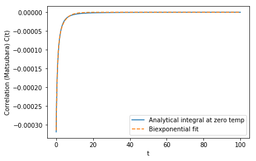

# matsubara
## Virtual excitations in the ultra-strongly-coupled spin-boson model: physical results from unphysical modes
Neill Lambert, Shahnawaz Ahmed, Mauro Cirio, Franco Nori

The is the code to reproduce the results in [arXiv:1903.05892](arXiv:1903.05892). A special `matsubara.heom.HeomUB` class is provided to implement the Hierarchical Equations of Motion method adapted for the underdamped Brownian motion spectral density.

We focus on the zero temperature case where the correlation function can be expressed using four exponents.

# Installation
The code is in development and can be used by cloning the repository and performing an in-place installation using python.
```
git clone https://github.com/pyquantum/matsubara.git
cd matsubara
python setup.py develop
```
Numpy, Scipy and QuTiP are required. Install them with conda if you do not already have them using
```
conda install -c conda-forge numpy scipy qutip
```

# Examples
In `matsubara/docs/source/examples/` there are several examples from the paper which can be easily
reproduced. The basic calcalation of the Matsubara and non Matsubara modes can be done in the following way:
```python
from matsubara.correlation import (nonmatsubara_exponents,
                                   matsubara_zero_exponents,
                                   biexp_fit, sum_of_exponentials)

coup_strength, cav_broad, cav_freq = 0.2, 0.05, 1.
tlist = np.linspace(0, 100, 1000)

# Zero temperature case beta = 1/kT
beta = np.inf
ck1, vk1 = nonmatsubara_exponents(lam, gamma, w0, beta)

# Analytical zero temperature calculation of the Matsubara correlation
mats_data_zero = matsubara_zero_exponents(lam, gamma, w0, tlist)

# Fitting a biexponential function
ck20, vk20 = biexp_fit(tlist, mats_data_zero)

print("Coefficients:", ck1, ck20)
print("Frequencies:", vk1, vk20)
```

```
Coefficients: [0., 0.02] [-0.00020, -0.00010]
Frequencies: [-0.025 + 0.99j, -0.025-0.99j] [-1.61 - 0.32]
```

